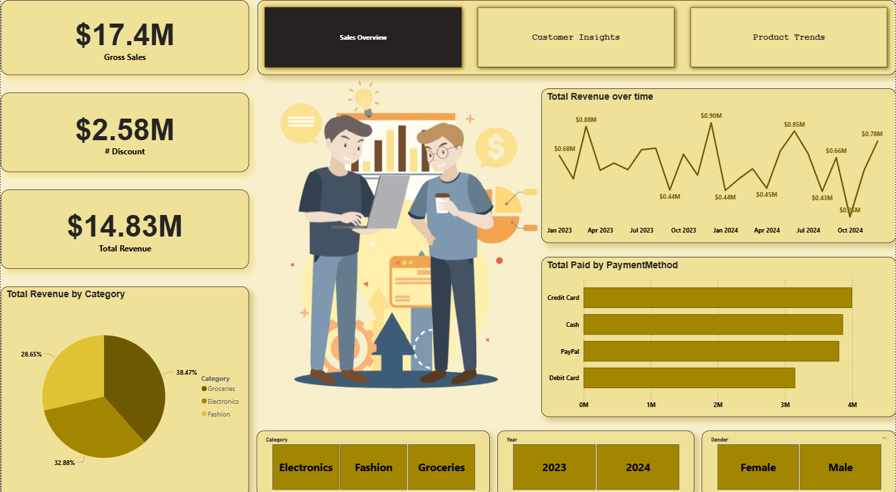

# 🛒 SuperMarket Data Analysis | Power BI Project

## 📋 Overview
This project represents a full **Data Analysis pipeline** for a supermarket dataset — starting from **data generation**, moving through **SQL storage and Python analysis**, and ending with an **interactive Power BI dashboard**.

The goal is to analyze sales, customer behavior, and product performance to gain business insights and visualize them clearly.



---

## 👥 Team Members
- **Noor Fared**  
- **Mohamed Ataa**  
- **Omar Mahmoud**

---

## 🧰 Tools & Technologies
1. 🧪 **Mockaroo** → Data generation (creating synthetic supermarket data)  
2. 🗄️ **SQL Server Management Studio (SSMS)** → Database creation & SQL queries  
3. 🐍 **Python (Jupyter Notebook)** → Data cleaning & analysis using:
   - `pandas`, `numpy`, `matplotlib`, `seaborn`, `streamlit`
4. 📊 **Power BI** → Dashboard creation & visualization

---

## 🔄 Project Phases

### **Phase 1 – Data Generation**
- Generated realistic supermarket data using **Mockaroo**.
- Created datasets for sales, customers, and products.

### **Phase 2 – SQL Phase**
- Created SQL tables and inserted Mockaroo data.
- Built **views** to simplify data extraction for Python.

### **Phase 3 – Python Phase**
- Imported SQL data into Python using `pandas`.
- Cleaned, transformed, and analyzed the data.
- Built **Streamlit views** for basic interactive visualization.

### **Phase 4 – Power BI Phase**
- Designed a fully interactive dashboard with multiple analytical pages.

#### 🔧 Power BI Features Used
- Tooltips  
- Drilldown / Drillthrough  
- Bookmarks  
- Slicers (Date, Category, Gender)  
- Navigation Buttons  
- Custom titles & layout design

---

## 🧹 Power BI Workflow
1. **Data Cleaning:** Power Query for preprocessing  
2. **Data Modeling:** Define relationships between tables  
3. **Visualization:** Build dashboards and KPIs  

---

## 📈 Dashboard Pages

1. **Sales Overview** → Analysis of total sales, revenue trends, and top products.  
2. **Customer Insights** → Customer segmentation by gender, age, and region.  
3. **Product Trends** → Product performance, categories, and time-based analysis.  
4. **Customer Details** → Individual customer data and detailed sales records.  
5. **Tooltip Page** → Used for hover-based contextual information in visuals.

---

## 📁 Repository Structure
```
SuperMarket_Analysis/
│
├── 📄 SuperMarket_Analysis.pbix          # Power BI report file
│
├── 📁 Dashboards                         # Screenshots of dashboard pages
│     ├── Sales_Overview.png
│     ├── Customer_Insights.png
│     ├── Product_Trends.png
│     ├── Customer_Details.png
│     └── Tooltip.png
│
├── 📁 Documents                          # Presentations, reports, and project files
│     └── SuperMarket_Presentation.pdf
│
└── 📄 README.md                          # Project documentation (this file)
```

---

## 🖥️ Tools Used Summary
| Tool | Purpose |
|------|----------|
| Mockaroo | Data generation |
| SQL Server | Data storage & querying |
| Python | Data cleaning & exploration |
| Streamlit | Interactive data view |
| Power BI | Final dashboard creation |

---

## 🎯 Conclusion
This project demonstrates a **complete data analysis lifecycle**, from data creation to visualization, providing valuable business insights for decision-making in the supermarket sector.

---

**📌 Created by:**  
*Data Analysis Team (Noor Fared, Mohamed Ataa, Omar Mahmoud)*
